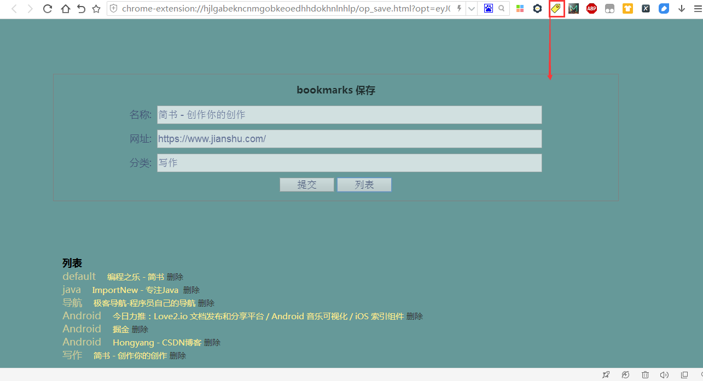

# bookmarks(简版书签)

## 介绍
代码和页面均比较简单粗略，主要是为了取代多数国内流氓的软件才多次一举。

## 原理
1. [bookmarks扩展](https://github.com/coding-dream/chrome_ex/tree/master/apps/bookmarks)
2. NanoHTTPD嵌入式Server，类似Tomcat，比较轻量级，就是一个小型Sockets实现的Little Server

作用比较大的还是扩展，扩展能够一直在浏览器中运行，Alt + I快捷键实现类似某些国产浏览器快速收藏的功能，
但是Chrome扩展的缺陷就是不能访问本地IO，所以需要一个小型的服务器默默运行。

代码量非常少，核心只有70行。

使用只需3步：
1. 点击bookmarks.bat
2. 安装bookmarks扩展
3. 访问任何网页，Alt + I管理书签

bookmarks.bat关闭时会自动同步到GitHub仓库，保证书签不会丢失，最重要的是我们的隐私安全不是吗？

